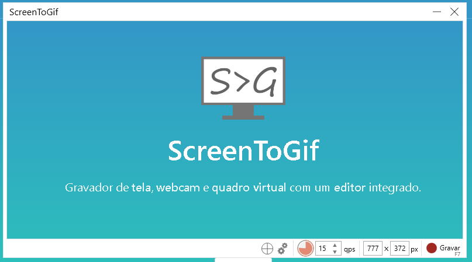

# Projeto com README
Um projeto de teste com arquivo README. 🤖


[](https://br.pinterest.com/search/pins/?q=cenas%20de%20luta%20jujutsu%20kaisen&rs=guide&journey_depth=1&source_module_id=OB_cenas_de_luta_jujutsu_kaisen_a04ae6a1-a0f7-451c-a763-31879bdbe258&add_refine=Cenas%20de%7Cguide%7Cword%7C2)


## Tecnologias utilizadas
- Screentogif
- Git Bash

## Como utilizar

1 - Clone o projeto
```
git clone https://github.com/heltonsdl/repositorio-com-readme.git
```
2 - Acesse a pasta do projeto
```
cd repositorio-com-readme

```
3- Execute a pasta com o VScode
```
code.
```


4 - Utilize o Scrrentogif para criar gif capturando imagens 
[](https://www.screentogif.com/)
Clique na imagem para ser direcionaro para o download.

5 - Personalize o README. 

[]

6 - Adicione os arquivos

```
git add .
```
7 - COMMIT!

```
git commit -m " "

```
8 - Puh!
```
git push
```